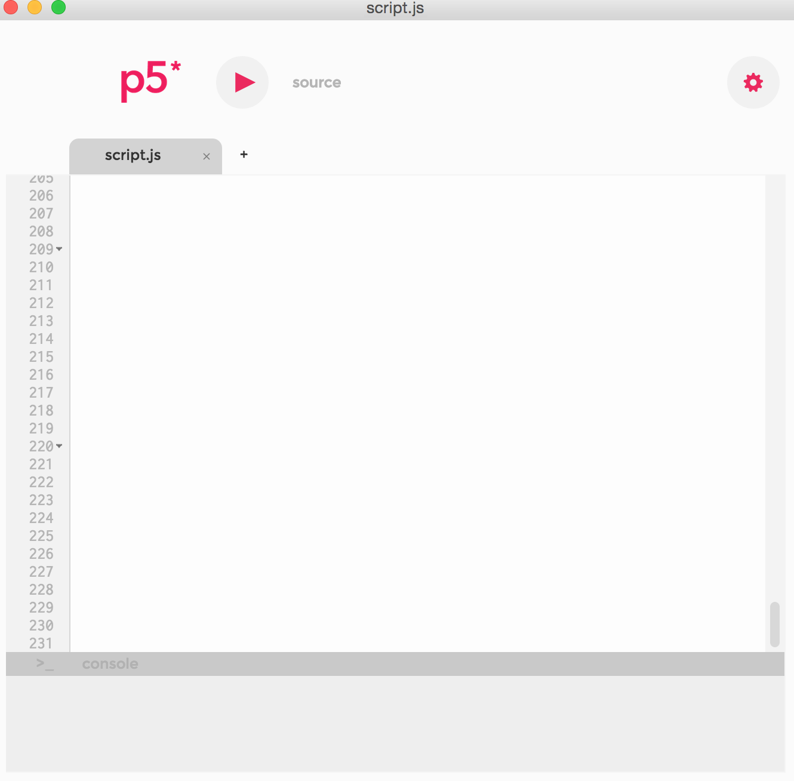
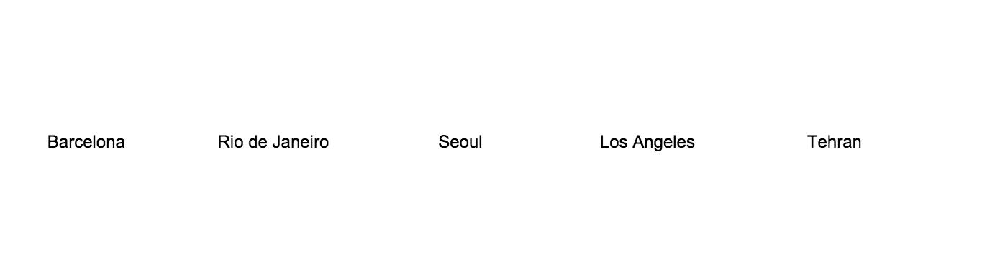

Exercise 1: Data Sunrise
========================


(I am unable to find the author of this gif, if you know her/him, let me know so I can credit)

Here we will play with some downloaded data. We will work with a JSON file with some weather and geographical data from [Open Weather Map](http://www.openweathermap.org/current) and we will build a visualization of the time at which the sun rises in 5 cities around the world.

Before starting
---------------

You will need p5's IDE and a JSON file included here called [5cities\_mini.json](5cities\_mini.json).

You will also need to download [p5.js' editor from here](https://p5js.org/download/). The application should look like this:



As an alternative to the editor, you can also use the template for a website in the folder [source](source). In fact, we suggest you learn how to manipulate the files themselves, but you can try that on your own.

**IMPORTANT** P5 is a young library based on Processing, and is a community-run project. This editor has been deprecated in pro of a web editor that is not yet ready. We think using this editor for a workshop is useful because it helps us focus on the code and the data, and forget about putting a site together or running a server, but be aware that this editor may stop working in the future. If you want to keep working with p5 you should probably learn to use it in a regular browser or more generic editor like Atom or Sublime.

Code
----

## 1. Start here

p5 is an implementation of Processing in javascript. The main magic happens between two functions, `setup` and `draw`. Keep refering to the documentation of [p5]() to find functions that are useful for what you want.

One you start the editor, it'll open a basic empty file with two functions.

You'll notice play button on top of the editor, which is used to _run_ the sketch. When you run the sketch, p5 runs a small server in the background and opens an HTML site that runs your sketch, which is how p5 generally works. You don't have to worry about this for now, but it'll be important for later projects.

So the two functions at the basis of the project are `setup()` and draw()`.

```
// _You may declare some variables here_
function setup() {
    // _Here you set up the variables and the canvas before starting_
}

function draw() {
    // _This function is called once every frame, so movements and dynamic functions will be called here_
}
```

In `setup` we can start the canvas where we are going to draw, and then draw some stuff using the `draw` function, for example, a big sun-like circle. Here we'll introduce also the notion of color.

```
var yellow;

function setup() {
  yellow = color(255, 204, 0, 50);
  createCanvas(800, 600);  
}

function draw() {
  fill(yellow);
  ellipse(200, 200, 50, 50);
}
```
There are a few things happening here:

- `createCanvas()` create a space of 800x600px where we are going to be drawing.
- For every frame, the `draw()` function draws a circle (or ellipse) of 50px of diameter, and it draws it at the coordinates (200, 200). The system of reference starts at (0, 0) on the top left corner of the canvas.

Since `draw()` is called once per frame, if we want to create something dynamic, it is here that we have to do it. For example, we can draw a circle that moves from left to right.

```
var yellow;
var xPos;

function setup() {
  yellow = color(255, 204, 0, 50);
  xPos = 0;
  createCanvas(800, 600);  
}

function draw() {
  xPos = xPos + 0.2;
  fill(yellow);
  ellipse(xPos, 200, 50, 50);
}
```

That's cool, the thing moves. We can also add some transparency to the color, change the stroke color and most importantly, repaint the background with every frame so that it doesn't leave this black trace, although if you like that it can be used for coolness too.


This gives us a lot of possibilities. You can for example use the mouse position to draw circles, like so:

```
var yellow;

function setup() {
  yellow = color(255, 204, 0, 50);
  createCanvas(800, 600);  
}

function draw() {
  fill(yellow);
  strokeWeight(2);
  stroke(255, 255, 255);
  ellipse(mouseX, mouseY, 50, 50);
}
```

This would give you something like:


Ok, now that we've started understanding how to draw things, let's load some data.

## 2. Let's get da'ty

Now that we have something going on, let's see if we can load some data and play around with. Let's look at the JSON file we have with weather and time information for a second, the `5cities\_mini.json`. We will load the file straight from the script, but let's start using it from a variable where we copy the content itself.

We've obtained this data from the [Open Weather Map API](http://openweathermap.org/current), which is a wonderful API to get started, very open and pretty easy to use. If you look at the file `5cities.json`, that is the format that comes straight from the API. I've simplified the data a little for this exercise. One option that the API allows is to pull weather data from several cities at the same time. We'll talk about how that works later, let's focus on the data for now (which has been very simplified to get started).

Our data contains an object, delimited by `{}` curly brackets, and an array, delimited by `[]`.

```
{
  "today": 1488326400,
  "list": [
    {
      "sunrise": 1488349619,
      "temp": 16.5,
      "wind": {
        "speed": 2.1,
        "deg": 230
      },
      "id": 6356055,
      "name": "Barcelona"
    },
    {
      "sunrise": 1488337514,
      "temp": 16.31,
      "wind": {
        "speed": 6.2,
        "deg": 270
      },
      "id": 112931,
      "name": "Tehran"
    }
    ...
}
```

You'll see this number for sunrise `1488349619`. This is called a Unix timestamp, and it is a way of standardizing all computer times. It refers to the number of seconds that have passed since January 1st 1970 in UTC time. (It is by the way going to stop working on 2038).

If you look at the data again, you'll see a `today` field, which is the timestamp for March 1st 2017 at midnight. We'll use that to know how many seconds will have passed before the sun rises in each city.

Let's go to the code and see how we access the data.

## 3. Access data and draw

Now let's go back to our code and see how we can access this data. We'll access some of the data and map it to a position.

To load a data file, we can use the function `loadJSON()`, which looks for a data in JSON. You can pass a file in your own system or a URL that you know is going to give back some JSON. We'll start by using our own file, `5cities_mini.json`.

```
var data;
function preload() {
  var url = './5cities_mini.json';
  data = loadJSON(url);
}
```

Since loading data takes always a certain amount of time, we'll use the function `preload()` **before** `setup()`, so that once the data is loaded, p5 knows it can start with the rest of the code. Note that I'm storing the data in a `data` variable for our use afterwards.

Cool, so now we have the data stored in this variable `data`, let's see how we can access it.

Notice that each city is stored as an object `{}` inside an array `[]`. In order to access the first object of the array (which is called `list` here), we do:

```
data.list[0]
```

which would be equal to:

```
{
  "sunrise": 1488349619,
  "temp": 16.5,
  "wind": {
    "speed": 2.1,
    "deg": 230
  },
  "id": 6356055,
  "name": "Barcelona"
}
```

Knowing this, we can access each one of them by running the same function five times, one per each city. For example, I'd like to draw the names of the cities. We'd do so with a `for` loop like:

```
for (var i = 0; i < data.list.length; i++) {
  fill(0);
  text(data.list[i].name + ": " + sunrise, cityX, 50);
}
```



Great, we've got some data and displayed it. Now let's look at the time data and what to do with that.

## 4. Data suns

Now we'll do a few more things. We'll get the sun hight based on the sunrise time of each city, making sure we're subtracting the timestamp since the beginning of the day.

Notice we're iterating over the cities that are accessed through `data.list`, picking the city with the `i` index and then accessing the sunrise timestamp with `data.list[i].sunrise`.

```
var yellow;
var pink;
var WIDTH = 800;
var HEIGHT = 400;
var labelsHeight = 50;
var skyHeight = HEIGHT - labelsHeight;

function setup() {
  yellow = color(255, 204, 0);
  pink = color(154, 124, 191);  
  createCanvas(WIDTH, HEIGHT);
}

function draw() {
  background(255);
  for (var i = 0; i < data.list.length; i++) {
    var sunrise = data.list[i].sunrise - data.today;
    var sunHeight = skyHeight - (skyHeight * sunrise/84600);
    var cityX = 130 * i + 30;

    // Labels
    fill(0);
    text(data.list[i].name + ": " + sunrise, cityX, HEIGHT - 50);

    // Suns
    fill(yellow);
    strokeWeight(2);
    stroke(255, 255, 255);
    ellipse(cityX + 25, sunHeight, 50, 50);
  }
}
```


Cool! Now the suns are up in the sky. Their height is an estimation of the time the sun rises in each city at UTC time.

Now the next cool thing to do would be to animate them. How would we do that?

We'll need to control time with the `frameCount()` and `frameRate()` functions. The first one gives us the number of frames that have passed since the application started running. The second one sets the frame per second. We'll set `frameRate(30)` inside `setup` and will use `frameCount` to get the seconds passed like:

```
var seconds = (frameCount/30) * 1000;
```

Here I speed things up by a factor of 1000, otherwise we'd be looking at suns move in regular speed, we'd barely see them moving.

Ok so now we need to calculate the speed the suns are rising based on those seconds, and calculate the height of each sun based on their individual sunrise times.

```
// sun speed
var yVel = skyHeight / 86400;

// sun height
var y = sunHeight - seconds * yVel;
```

Great. Now we just have to update our `draw()` function with this new factors (make sure you've declared `seconds` and `yVel` in `setup` beforehand):

```
function draw() {
  background(255);

  seconds = (frameCount/30) * 1000;

  for (var i = 0; i < data.list.length; i++) {
    var sunrise = data.list[i].sunrise - data.today;
    var cityX = 130 * i + 30;
    var sunHeight = skyHeight - (skyHeight * sunrise/84600);

    var y = sunHeight - seconds * yVel;

    // Background sky
    fill(pink)
    rect(cityX - 30, 0, 130, skyHeight)

    // Suns
    fill(255, 204, 0);
    strokeWeight(2);
    stroke(255, 255, 255);
    ellipse(cityX + 35, y, 50, 50);

    // Labels
    fill(255);
    rect(cityX, skyHeight, 130, 50);
    fill(0);
    textAlign(CENTER);
    text(data.list[i].name, cityX + 35, HEIGHT - 20);
  }

  // Second counter
  fill(0);
  text(seconds.toFixed(0), 30, 30);
}
```

And boom!


## 5. Next steps

In the next exercise we'll look at how to load data on the fly with a call. To load this data from the script itself and Open Weather Map endpoints, you would use something like this:

```
var weather;
function preload() {
  var url = 'http://api.openweathermap.org/data/2.5/group?id=6356055,3451190,1835848,5368361,112931&units=metric&appid={{ YOUR API KEY }}
  weather = loadJSON(url);
}
```

[Go back to main file](../README.md)
