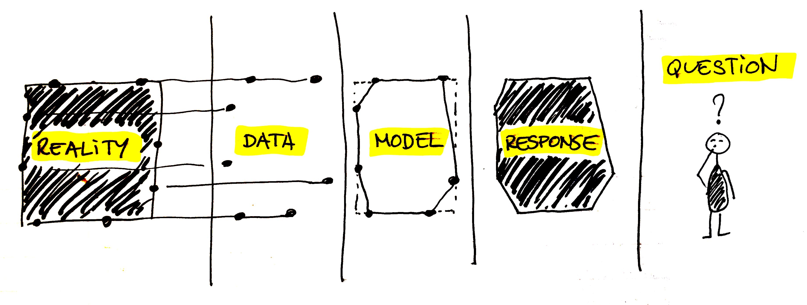

Data-Data Workshop
==================

"What does a baby computer call its father?"

"Data."

**_Her_**, Spike Jonze


Overview
--------

- This workshop will be taught by Thibaut Evrard and Franc Camps-Febrer at the RCA on March 1st, 2017.
- The workshop is framed within the Desense elective, run by John Fass and Matt Lewis, which is part of the IED Master at the Royal College of Art (London).
- The workshop is provided _as is_, with no guarantees of epiphanies or life-changing experiences, but a positive hope of being helpful.

Description
------------

In this workshop we will learn how to use data to express, analyze and create. We will go through some of
the most common data formats and we will review a couple of easy ways of obtaining and working with data.

What is data? And what can be done with it?
-------------------------------------------



Data art, visualization or sonification are forms of translation and mapping from data onto perceptual experiences that may provide different channels to incorporate sensory and intellectual information in our models.

How do you go from this...

```
{
  "coord": {
    "lon": 2.13,
    "lat": 41.4
  },
  "temp": 16.5,
  "pressure": 1018,
  "humidity": 45,
  "visibility": 10000,
  "wind": {
    "speed": 2.1,
    "deg": 230
  },
  "id": 6356055,
  "name": "Barcelona"
}
```

...to this?


_Sound Sculpture - Onformative (2012)_

### What are some examples of data art / visualization / design?
A list of examples:
- [We feel fine - Jonathan Harris](http://number27.org/wefeelfine)
- [Dear Data - Stephanie Posavec, Giorgia Lupi](http://www.dear-data.com/theproject)
- [SoundSculpture - onformative](http://onformative.com/work/unnamed-soundsculpture)
- [Ishac Bertran - Searches](http://www.ishback.com/searches/index.html)
- [Joy Division, Peter Saville](https://vimeo.com/51365288)
- [Everyone Ever in the world - Peter Crnokrak](http://www.petercrnokrak.com/everyone-ever-in-the-world/)
- [Maral Pourkazemi](http://www.monoment.io)
- [Miles Davis' Legacy - Polygraph](http://polygraph.cool/miles/)
- [Out of Sight, Out of Mind - Pitch Interactive](http://drones.pitchinteractive.com/)
- [Wind Map - PointB](http://hint.fm/wind/)
- [Meshu](http://meshu.io/)
- [Just Landed - ](https://vimeo.com/4587178)
- [MTA.me - Alexander Cheng](http://www.mta.me/)
- [Nicolas Feltron](http://feltron.com/FAR14.html)
- [p5, Patterned By Nature, Data Chandelier - Lauren McCarthy](http://lauren-mccarthy.com/)
- [Meshu - Rachel Binx](http://meshu.io/gallery/)
- [Histography](http://histography.io/)
- [Quotidian Record - Brian House](http://brianhouse.net/works/quotidian_record/)

### What are some common data formats?

Let's talk about data formats: JSON, CSV, XML, XLS

**JSON**
```
{
  "coord": {
    "lon": 2.13,
    "lat": 41.4
  },
  "temp": 16.5,
  "pressure": 1018,
  "humidity": 45,
  "visibility": 10000,
  "wind": {
    "speed": 2.1,
    "deg": 230
  },
  "id": 6356055,
  "name": "Barcelona"
}
```

**CSV**
```
"KpiId","KpiName","Value","Period","CollectionFrequency"
"CJGE32","Business","127","2014/2015_Apr","23", "Something"
"CJGE32","Business","235","2014/2015_May","23", "Something"
"CJGE32","Business","324","2014/2015_Jun","23", "Something"
"CJGE32","Business","431","2014/2015_Jul","23", "Something"
```

**XML**
```
<note>
  <to>Tove</to>
  <from>Jani</from>
  <heading>Reminder</heading>
  <body>Don't forget me this weekend!</body>
</note>
```

Exercise 1
----------

Tutorial:
We will use a prepackaged JSON file and play around with it using p5.

[Go to Exercise 1](Exercise1/)

What is an Application Programming Interface or API?
--------------

In very abstract and simplified terms, an API is a set of tools that an application provides in order to interact with it _programmatically_, that is, using code. In our context, we will usually understand it as a web API, which tends to refer to a set of URLs that web application provides so that we can get some data from it or post some data onto the application.

The API of Youtube will allow to get information from Youtube's search results that would usually be relatively difficult to get from its interface, such as the most viewed videos in a certain radius, which will be the topic of our second exercise.

Another example for API use are Twitter bots, applications that _POST_ to Twitter automatically given a set of conditions, such as [Two Headlines](https://twitter.com/TwoHeadlines), [Every Color](https://twitter.com/everycolorbot) or [NYPD edits](https://twitter.com/nypdedits).

Examples can be found here:
- [Programmable Web - a long list of available APIs](http://www.programmableweb.com)

Exercise 2: Live API data
-------------------------

We will be using live API data to visualize / sonify / texify it and play around.

Go to [Exercise 2](Exercise2/).

A note about open data
----------------------

The Open Knowledge International defines open data as:

```
“Open means anyone can freely access, use, modify, and share for any purpose (subject, at most, to requirements that preserve provenance and openness).”
```

This means open data must be free to use, must have minimized its barriers of access and free to re-use and redistribute. It is a very large and important topic in the current state of our society, and the precise definition of it has enormous legal, political and cultural implications. 

For a longer, more detail and precise explanation that I will ever be able to give, see the [Open Data Handbook](http://opendatahandbook.org/) edited by the Open Knowledge Foundation and the World Bank.

Open Data repositories examples:
- [London Open Data](https://data.london.gov.uk)
- [UK GOV](https://data.gov.uk/)
- [World Bank](http://data.worldbank.org/)

Extra: here is an [interesting article](https://medium.com/memo-random/open-for-who-ce698a8de79c#.g3wbg34ms) about standarizing a definition of open based on a scale from 0 to 5, by the founder of The Office for Creative Research in NYC.

Resources and tools to learn more
---------------------------------

**Editors**
- [Atom](https://atom.io/) is a powerful editor for any programming language you would like to use, and very easily integrated with Github (it is also developed by them).
- [Sublime](https://www.sublimetext.com/3) is another great editor, for free.
- p5 has an [editor](https://github.com/processing/p5.js-editor) but is deprecated, meaning it is no longer supported. You can use it in the meantime as a testing tool, and it is useful to simply try things out, but make no long-term plans with it.

**Visual tools and libraries**
- [p5](https://p5js.org) is an implementation of Processing as a javascript library, so that you can code processing sketches and display on the web. 
- [Processing](https://processing.org/) You know this.
- [openFrameworks](openframeworks.cc) is a set of tools and libraries written in C++ designed for creative coding. It can be a daunting in the beginning but it is extremely powerful and widely used.
- [d3](https://d3js.org/) is a library for data manipulation and visualization in the web, using SVG and javascript.
- [Paper.js](http://paperjs.org/examples/q-bertify/) is another visual library for javascript, fairly simple although not so popular.
- [THREE.js](http://www.threejs.org) is a 3D rendering library for javascript, based on WebGL. You can do some really crazy stuff with it.

**Other tools**
- [POSTMAN](https://www.getpostman.com/) is a tool for testing API calls.

**Learning resources**
- [Introduction to Data Visualization - UC Berkeley](http://paldhous.github.io/ucb/2016/dataviz/index.html) is a wonderful resource for data visualization, focusing on the analytical and rational part, more than the expressive one, but if you're into that, it's highly recommended.
